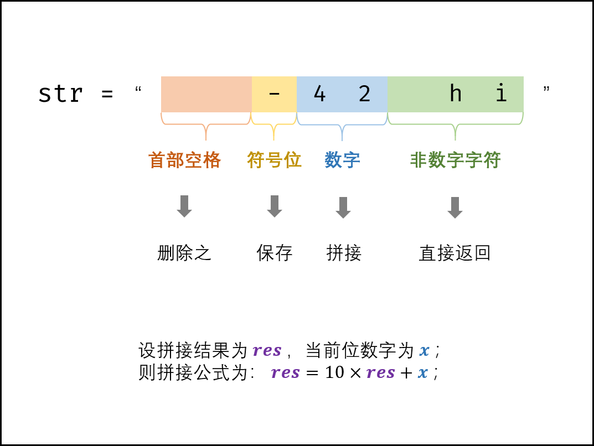

## question
[剑指 Offer 67. 把字符串转换成整数](https://leetcode-cn.com/problems/ba-zi-fu-chuan-zhuan-huan-cheng-zheng-shu-lcof/)
写一个函数 StrToInt，实现把字符串转换成整数这个功能。不能使用 atoi 或者其他类似的库函数。

 

首先，该函数会根据需要丢弃无用的开头空格字符，直到寻找到第一个非空格的字符为止。

当我们寻找到的第一个非空字符为正或者负号时，则将该符号与之后面尽可能多的连续数字组合起来，作为该整数的正负号；假如第一个非空字符是数字，则直接将其与之后连续的数字字符组合起来，形成整数。

该字符串除了有效的整数部分之后也可能会存在多余的字符，这些字符可以被忽略，它们对于函数不应该造成影响。

注意：假如该字符串中的第一个非空格字符不是一个有效整数字符、字符串为空或字符串仅包含空白字符时，则你的函数不需要进行转换。

在任何情况下，若函数不能进行有效的转换时，请返回 0。

说明：

假设我们的环境只能存储 32 位大小的有符号整数，那么其数值范围为 [−231,  231 − 1]。如果数值超过这个范围，请返回  INT_MAX (231 − 1) 或 INT_MIN (−231) 。

示例 1:

输入: "42"
输出: 42
示例 2:

输入: "   -42"
输出: -42
解释: 第一个非空白字符为 '-', 它是一个负号。
     我们尽可能将负号与后面所有连续出现的数字组合起来，最后得到 -42 。
示例 3:

输入: "4193 with words"
输出: 4193
解释: 转换截止于数字 '3' ，因为它的下一个字符不为数字。
示例 4:

输入: "words and 987"
输出: 0
解释: 第一个非空字符是 'w', 但它不是数字或正、负号。
     因此无法执行有效的转换。
示例 5:

输入: "-91283472332"
输出: -2147483648
解释: 数字 "-91283472332" 超过 32 位有符号整数范围。 
     因此返回 INT_MIN (−231) 。
 

注意：本题与主站 8 题相同：https://leetcode-cn.com/problems/string-to-integer-atoi/

通过次数21,655提交次数78,580

## solution
根据题意，有以下四种字符需要考虑：


首部空格： 删除之即可；
符号位： 三种情况，即 ''++'' , ''-−'' , ''无符号" ；新建一个变量保存符号位，返回前判断正负即可。
非数字字符： 遇到首个非数字的字符时，应立即返回。
数字字符：
字符转数字： “此数字的 ASCII 码” 与 “ 00 的 ASCII 码” 相减即可；
数字拼接： 若从左向右遍历数字，设当前位字符为 cc ，当前位数字为 xx ，数字结果为 resres ，则数字拼接公式为：
res = 10 \times res + x \\ x = ascii(c) - ascii('0')
res=10×res+x
x=ascii(c)−ascii( ′ 0 ′ )


数字越界处理：

题目要求返回的数值范围应在 [-2^{31}, 2^{31} - 1][−2 31 ,2 31 −1] ，因此需要考虑数字越界问题。而由于题目指出 环境只能存储 32 位大小的有符号整数 ，因此判断数字越界时，要始终保持 resres 在 int 类型的取值范围内。

在每轮数字拼接前，判断 resres 在此轮拼接后是否超过 21474836472147483647 ，若超过则加上符号位直接返回。
设数字拼接边界 bndry = 2147483647 // 10 = 214748364bndry=2147483647//10=214748364 ，则以下两种情况越界：

\begin{cases} res > bndry & 情况一：执行拼接 10 \times res \geq 2147483650 越界 \\ res = bndry, x > 7 & 情况二：拼接后是 2147483648 或 2147483649 越界 \\ \end{cases}{ res>bndryres=bndry,x>7
​	
  
情况一：执行拼接10×res≥2147483650越界
情况二：拼接后是2147483648或2147483649越界
​	
 


复杂度分析：
时间复杂度 O(N)O(N) ： 其中 NN 为字符串长度，线性遍历字符串占用 O(N)O(N) 时间。
空间复杂度 O(N)O(N) ： 删除首尾空格后需建立新字符串，最差情况下占用 O(N)O(N) 额外空间。

作者：jyd
链接：https://leetcode-cn.com/problems/ba-zi-fu-chuan-zhuan-huan-cheng-zheng-shu-lcof/solution/sword-shi-ti-67-ba-zi-fu-chuan-zhuan-huan-cheng-z-4/
来源：力扣（LeetCode）
著作权归作者所有。商业转载请联系作者获得授权，非商业转载请注明出处。
### code f
```py
class Solution(object):
    def strToInt(self, str):
        """
        :type str: str
        :rtype: int
        """
        str = str.strip()                      # 删除首尾空格
        if not str: return 0                   # 字符串为空则直接返回
        res, i, sign = 0, 1, 1
        int_max, int_min, bndry = 2 ** 31 - 1, -2 ** 31, 2 ** 31 // 10
        if str[0] == '-': sign = -1            # 保存负号
        elif str[0] != '+': i = 0              # 若无符号位，则需从 i = 0 开始数字拼接
        for c in str[i:]:
            if not '0' <= c <= '9' : break     # 遇到非数字的字符则跳出
            if res > bndry or res == bndry and c > '7': return int_max if sign == 1 else int_min # 数字越界处理
            res = 10 * res + ord(c) - ord('0') # 数字拼接
        return sign * res


```