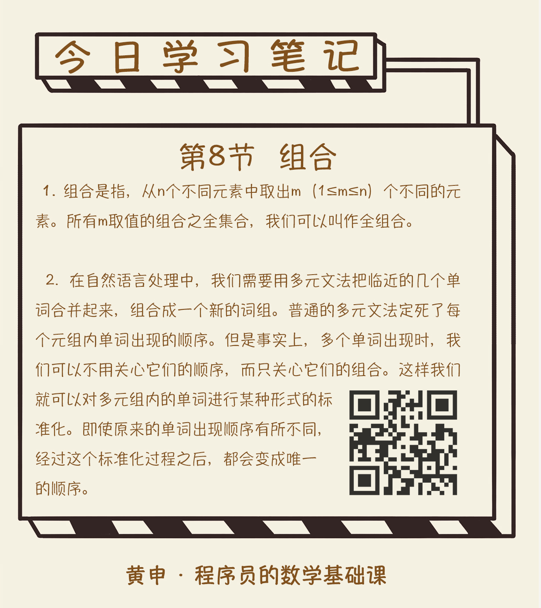

从定义上来说，组合是指，从 n 个不同元素中取出 m（1≤m≤n）个不同的元素。
例如，我们前面说到的世界杯足球赛的例子，从 32 支球队里找出任意 2 支球队进行比赛，就是从 32 个元素中取出 2 个元素的组合。如果上一讲中，田忌赛马的规则改一下，改为从 10 匹马里挑出 3 匹比赛，但是并不关心这 3 匹马的出战顺序，那么也是一个组合的问题。对于所有 m 取值的组合之全集合，我们可以叫作全组合（All Combination）。例如对于集合{1, 2, 3}而言，全组合就是`{{}, {1}, {2}, {3}, {1, 2}, {1,3} {2, 3}, {1, 2, 3}}`。如果我们安排足球比赛时，不考虑主客场，也就是不考虑这两只球队的顺序，两队只要踢一次就行了。那么从 n 个元素取出 m 个的组合，有多少种可能呢？我们假设某种运动需要 3 支球队一起比赛，那么 32 支球队就有 `32*31*30` 种排列，如果三支球队在一起只要比一场，那么我们要抹除多余的比赛。三支球队按照任意顺序的比赛有 `3*2*1=6` 场，所以从 32 支队伍里取出 3 支队伍的组合是 `(32*31*30)/(3*2*1)`。
基于此，我们可以扩展成以下两种情况。

**n 个元素里取出 m 个的组合，可能性数量就是 n 个里取 m 个的排列数量，除以 m 个全排列的数量，也就是` (n! / (n-m)!) / m!`。**
**对于全组合而言，可能性为 `2^n` 种。例如，当 n=3 的时候，全组合包括了 8 种情况。**

<!-- TOC -->

- [世界杯组队](#世界杯组队)
    - [简单](#简单)
            - [精简代码](#精简代码)
        - [暴力](#暴力)
- [纸币组合](#纸币组合)
- [组合的应用](#组合的应用)

<!-- /TOC -->



# 世界杯组队
## 简单
显然，还有更好的做法。从图中我们可以看出被划掉的那些，都是那些出现顺序和原有顺序颠倒的元素。例如，在原有集合中，t1 在 t2 的前面，所以我们划掉了`{t2, t1}`的组合。这是因为，我们知道 t1 出现在 t2 之前，t1 的组合中一定已经包含了 t2，所以 t2 的组合就无需再考虑 t1 了。因此，我只需要在原有的排列代码中，稍作修改，***每次传入嵌套函数的剩余元素，不再是所有的未选择元素，而是出现在当前被选元素之后的那些***。具体代码是这样的：
```py

# -*- coding: utf-8 -*-

import copy
class horse(object):
    def __init__(self):
        self.aa = [1, 2, 3, 4,5]
        # self.aa = [1, 2, 3]
        # self.aa = [1, 2, 3, 4, 5,6]    ## 所有元素
        self.len = len(self.aa)
        self.n = 3                      ## 从所有元素 中 取 n个。

    def _get_all_set(self, _list, n):              ## 获取所有可能的 组合
        if n+1 == self.n: 
            _res = []
            for i in _list:
                aa = [i]
                _res.append(aa)
            return _res
        _res = []
        n = n + 1
        for _index,i in enumerate(_list): 
            __bb = _list[_index+1:]
            _val = self._get_all_set(__bb, n)
            for ij in _val:
                ij.append(i)
                _res.append(ij)
        return _res

    def main(self):
        bb = self._get_all_set(self.aa, 0)
        for i in bb:
            print i 
        print len(bb)

client = horse()
client.main()
```
#### 精简代码
```py
# -*- coding: utf-8 -*-

import copy
class horse(object):
    def __init__(self):
        # self.aa = [1, 2, 3, 4,5]   ## 10 种
        # self.aa = [1, 2, 3]
        self.aa = [1, 2, 3, 4, 5,6]    ## 所有元素 20种
        self.len = len(self.aa)
        self.n = 3 

    def _get_all_set(self, _list, n):
        if n+1 == self.n: return [ [i] for i in _list ]
        _res = []
        for _index,i in enumerate(_list): 
            _val = self._get_all_set(_list[_index+1:], n+1)
            for ij in _val:
                ij.append(i) 
                _res.append(ij)
        return _res

    def main(self):
        bb = self._get_all_set(self.aa, 0)
        for i in bb: print i 
        print len(bb)

client = horse()
client.main()
```


### 暴力
那么，如何使用代码来实现呢？一种最简单粗暴的做法是：先实现排列的代码，输出所有的排列。例如{t1, t2}, {t2, t1}；针对每种排列，对其中的元素按照一定的规则排序。那么上述两种排列经过排序后，就是{t1, t2}, {t1, t2}；对排序后的排列，去掉重复的那些。上述两种排列最终只保留一个{t1, t2}。这样做效率就会比较低，很多排列生成之后，最终还是要被当做重复的结果去掉。
```py
# -*- coding: utf-8 -*-

import copy
class horse(object):
    def __init__(self):
        # self.aa = [1, 2, 3, 4]
        # self.aa = [1, 2, 3, 4]
        self.aa = [1, 2, 3, 4, 5,6]    ## 所有元素
        self.len = len(self.aa)
        self.n = 3                      ## 从所有元素 中 取 n个。

    def _get_all_set(self, _list, n):              ## 获取所有可能的 组合
        if len(_list) == (self.len - n + 1): 
            _res = []
            for i in _list:
                aa = [i]
                _res.append(aa)
            return _res
        _res = []
        for i in _list: 
            _list.remove(i)
            _val = self._get_all_set(_list, n)
            for ij in _val:
                ij.append(i)
                ij.sort()
                if  ij not in _res: _res.append(ij)
            _list.append(i)
        return _res

    def main(self):
        bb = self._get_all_set(self.aa, self.n)
        for i in bb:
            print i 

client = horse()
client.main()
```

# 纸币组合
国王需要支付一定数量的赏金，而宰相要列出所有可能的钱币组合，
这使用了排列组合的思想。如果这个问题再变化为“给定总金额和可能的钱币面额，能否找出钱币数量最少的奖赏方式？

数学办法可以用总金额依次对最大金额纸币求余数，直到为0.商相加为答案。如：若 {2, 3, 7}为纸币金额，
对于100，所需最小纸币数：100/7=14余2; 2/2 = 1余0;则纸币数为14+1=15

```py
# -*- coding: utf-8 -*-
def _min_num(num, _list):
    sorts = _list
    i = len(sorts) - 1
    if _list == []: return -1
    if num % sorts[i] == 0: 
        print '## ',sorts[i] ,' * ',num/sorts[i]
        return num/sorts[i] 
    elif num/sorts[i] >= 0:                                 ## num/sorts[i] == 0, it is ok.
        _num = _min_num(num % sorts[i], _list[:i])
        if _num == -1:                              
            for j in xrange((num/sorts[i]-1),-1,-1):        ## like 22 = 7*2 + 3*2 + 2*1，  but when 22 = 7*3 ,it returns -1.
                _num2 =  _min_num((num - sorts[i] * j), _list[:i])
                if _num2 > 0: 
                    print '## ',sorts[i] ,' * ',j
                    return _num2 + j
            return -1                                       ## each of all failed.  
        else:
            print '## ',sorts[i] ,' * ',num/sorts[i]
            return _num + num/sorts[i] 
    else:
        pass


sorts = [2,3,7,13]
print _min_num(216,sorts)  
"""
PS C:\Users\math> python .\test.py
##  2  *  1
##  3  *  2
##  7  *  0
##  13  *  16
19
"""     

```

# 组合的应用
组合的应用：如何高效地处理词组？
组合在计算机领域中也有很多的应用场景。比如大型比赛中赛程的自动安排、多维度的数据分析以及自然语言处理的优化等等。
在我之前的研究工作中，经常要处理一些自然语言，用组合的思想提升系统性能。今天我结合自己亲身的经历，先来说说组合在自然语言处理中的应用。
当时，我们需要将每篇很长的文章，分隔成一个个的单词，然后对每个单词进行索引，便于日后的查询。但是很多时候，光有单个的单词是不够的，还要考虑多个单词所组成的词组。例如，“red bluetooth mouse”这样的词组。
处理词组最常见的一种方式是多元文法。什么是多元文法呢？这词看起来很复杂，其实就是把临近的几个单词合并起来，组合一个新的词组。比如我可以把“red”和“bluetooth”合并为“red bluetooth”，还可以把“bluetooth”和“mouse”合并为“bluetooth mouse”。设计多元文法只是为了方便计算机的处理，而不考虑组合后的词组是不是有正确的语法和语义。例如“red bluetooth”，从人类的角度来看，这个词就很奇怪。但是毕竟它还会生成很多合理的词组，例如“bluetooth mouse”。所以，如果不进行任何深入的语法分析，我们其实没办法区分哪些多元词组是有意义的，哪些是没有意义的，因此最简单的做法就是保留所有词组。普通的多元文法本身存在一个问题，那就是定死了每个元组内单词出现的顺序。例如，原文中可能出现的是“red bluetooth mouse”，可是用户在查询的时候可能输入的是“bluetooth mouse red”。这么输入肯定不符合语法，但实际上互联网上的用户经常会这么干。

那么，在这种情况下，如果我们只保留原文的“red bluetooth mouse”，就无法将其和用户输入的“bluetooth red mouse”匹配了。所以，如果我们并不要求查询词组中单词所出现的顺序和原文一致，那该怎么办呢？我当时就在想，可以把每个二元或三元组进行全排列，得到所有的可能。但是这样的话，二元组的数量就会增加 1 倍，三元组的数量就会增加 5 倍，一篇文章的数据保存量就会增加 3 倍左右。我也试过对用户查询做全排列，把原有的二元组查询变为 2 个不同的二元组查询，把原有的三元组查询变为 6 个不同的三元组查询，但是事实是，这样会增加实时查询的耗时。于是，我就想到了组合。多个单词出现时，我并不关心它们的顺序（也就是不关心排列），而只关心它们的组合。因为无需关心顺序，就意味着我可以对多元组内的单词进行某种形式的标准化。即使原来的单词出现顺序有所不同，经过这个标准化过程之后，都会变成唯一的顺序。例如，“red bluetooth mouse”，这三个词排序后就是“bluetooth,mouse,red”，而“bluetooth red mouse”排序后也是“bluetooth,mouse,red”，自然两者就能匹配上了。我需要做的事情就是在保存文章多元组和处理用户查询这两个阶段分别进行这种排序。这样既可以减少保存的数据量，同时可以减少查询的耗时。这个问题很容易就解决了。怎么样，组合是不是非常神奇？此外，组合思想还广泛应用在多维度的数据分析中。比如，我们要设计一个连锁店的销售业绩报表。这张报表有若干个属性，包括分店名称、所在城市、销售品类等等。那么最基本的总结数据包括每个分店的销售额、每个城市的销售额、每个品类的销售额。除了这些最基本的数据，我们还可以利用组合的思想，生成更多的筛选条件

